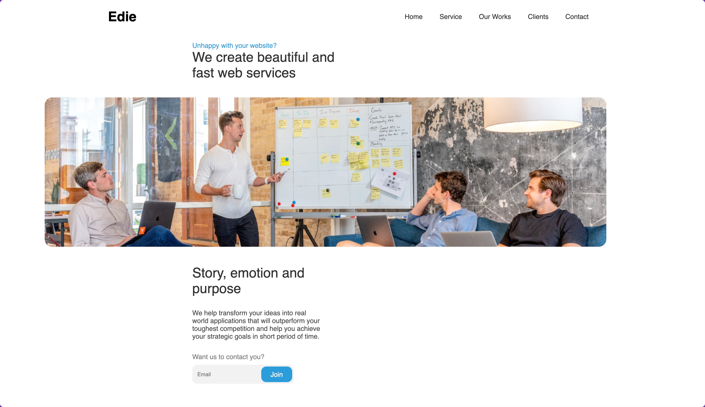
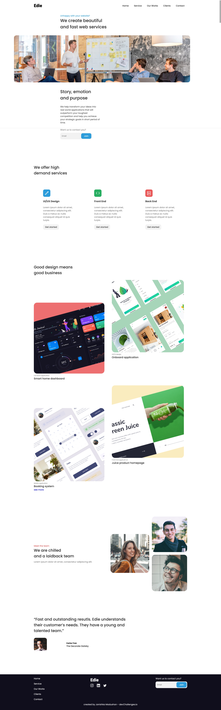

# Edie Homepage



A professional and responsive homepage built as part of a Dev Challenges project. This project demonstrates modern HTML, CSS, and JavaScript techniques for building a clean, user-friendly homepage experience.

## Features
- Responsive design for desktop and mobile
- Modern, clean UI
- Organized layout for content and team sections
- Interactive elements powered by JavaScript
- Accessible and semantic HTML structure

## Technologies Used
- HTML5
- CSS3
- JavaScript (Vanilla)

## Getting Started
1. Clone the repository:
   ```bash
   git clone https://github.com/JanishkaM/edie-homepage-master.git
   ```
2. Open `index.html` in your browser to view the homepage.

## Folder Structure
```
edie-homepage-master/
├── index.html
├── README.md
├── assets/
│   ├── script.js
│   └── style.css
├── img/
│   ├── booking.png
│   ├── devchallenges.png
│   ├── heroImage.jpg
│   ├── instagram.svg
│   ├── juice-product.png
│   ├── linkedin.svg
│   ├── onboard.png
│   ├── person1.png
│   ├── person2.png
│   ├── person3.png
│   ├── person4.png
│   ├── screenshot-full.jpeg
│   ├── screenshot.png
│   ├── smarthome.jpg
│   ├── twitter.svg
```

## Screenshots


## Credits
- [Dev Challenges](https://devchallenges.io/) for the project inspiration

## License
This project is licensed under the MIT License.
